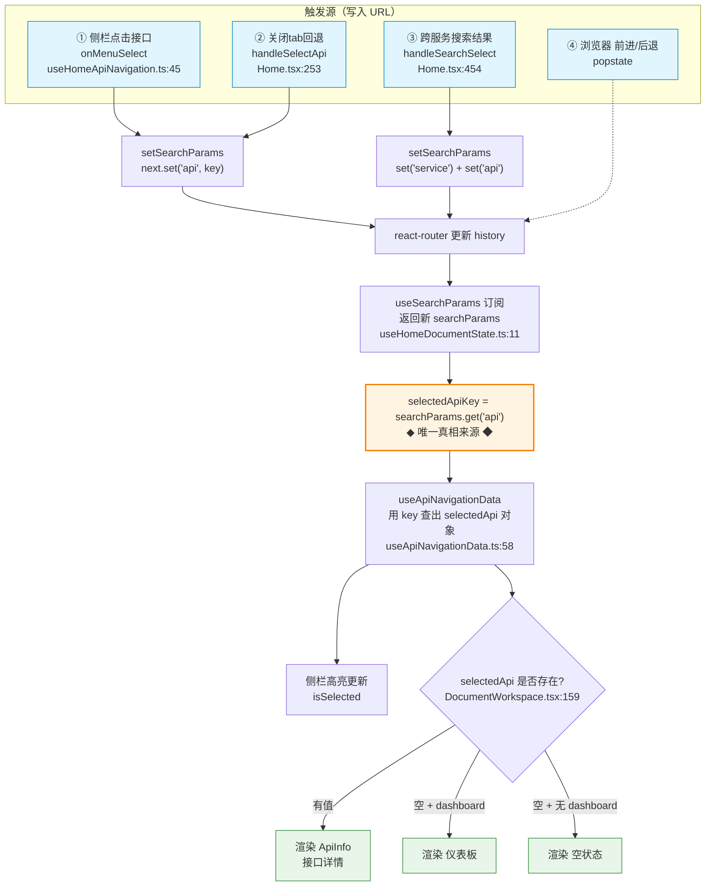

# 接口切换的 URL → 视图 流程

> 本文档说明在 `ui/` 中「切换接口时页面 URL 变化」这一行为的影响范围。
> 结论：URL 里的 `?api=` 参数是「当前选中接口」的**唯一真相来源**，URL 变化会直接驱动视图重渲染，不是装饰性副作用。

---

## ASCII 流程图

```
┌──────────────────────────────────────────────────────────────────┐
│                            触发源                                 │
├──────────────────────────────────────────────────────────────────┤
│ ① 侧栏点击接口      onMenuSelect        useHomeApiNavigation.ts:45│
│ ② 关闭tab回退       handleSelectApi     Home.tsx:253              │
│ ③ 跨服务搜索结果    handleSearchSelect  Home.tsx:454              │
│ ④ 浏览器 前进/后退   popstate（react-router 内部监听）             │
└──────────────────────────────────────────────────────────────────┘
        │ ①②③ 调用 setSearchParams({ api: key })
        │ ④   history 变化
        ▼
┌───────────────────────────────────┐
│  react-router 更新 history         │
└───────────────────────────────────┘
        │
        ▼
┌────────────────────────────────────────────────────┐
│ useSearchParams 订阅 → 返回新 searchParams         │
│                                                    │
│   selectedApiKey = searchParams.get("api")  ◄── 唯一真相来源
│   (useHomeDocumentState.ts:11)                     │
└────────────────────────────────────────────────────┘
        │
        ▼
┌────────────────────────────────────────────────────┐
│ useApiNavigationData 用 key 查出 selectedApi 对象   │
│   (useApiNavigationData.ts:58-65)                  │
└────────────────────────────────────────────────────┘
        │
        ├──► 侧栏高亮更新  isSelected (useApiNavigationData.ts:47)
        │
        ▼
┌──────────────────────────────────────────┐
│ DocumentWorkspace 分支判断 (:159-170)     │
└──────────────────────────────────────────┘
        │
   ┌────┼─────────────────┐
   ▼    ▼                 ▼
 selectedApi        selectedApi         selectedApi
  有值               空 + dashboard      空 + 无 dashboard
   │                  │                   │
   ▼                  ▼                   ▼
 渲染 ApiInfo       渲染 仪表板          渲染 空状态
 (接口详情)


旁路 ─────────────────────────────────────────────
│ 打开的 tab 列表 (viewedApiKeys) 是 React state + localStorage
│   ↑ 不走 URL；只有「当前激活哪个 tab」才进 URL
│   ↑ 关闭当前 tab → 先算相邻 fallback key → 再走 ② 写入 URL
└────────────────────────────────────────────────
```

---

## Mermaid 流程图

> 可在 GitHub、VSCode Mermaid 插件、Mermaid Live Editor 中直接渲染。



---

## 关键读图要点

1. **URL 是状态，不是副作用** —— `?api=` 这一个查询参数独占「当前选中接口」的状态，没有平行的 React state 镜像它。
2. **三个写入点 + 一个外部触发** 汇聚到同一条 `history → useSearchParams → selectedApiKey` 主线。
3. **侧栏高亮和主区域渲染共用同一个 `selectedApi`**，所以二者永远同步——不会出现「侧栏亮 A、右边显示 B」。
4. **tab 列表不在主线上**：打开哪些 tab 是 localStorage 状态，URL 只记录「当前激活 tab」。关闭当前 tab 时才借道 ② 回写 URL。
5. **没有任何手动 `popstate` / `hashchange` 监听器**，全部靠 react-router 的 `useSearchParams` 订阅 history。

---

## 状态分层

这套数据流实际上把状态分成了三层，分层原则应显式遵守，防止后续腐化：

| 层 | 载体 | 内容 | 判断依据 |
|----|------|------|----------|
| 可分享状态 | URL（`?api=` 等） | `api`, `service`, `doc`, `local`, `demo` | 刷新需保持、且需要分享/定位的 |
| 会话状态 | localStorage | tab 列表、搜索记录 | 需跨刷新保持、但不必分享的 |
| 临时状态 | React state | loading、展开折叠、输入框内容 | 丢弃无所谓的 |

**原则**：新状态默认放临时 state；若"刷新后丢失会困扰用户"则升到 localStorage；若"需要分享给别人或刷新必须还原"则升到 URL。

**反模式**：
- 把本该进 URL 的选中态只放进 React state → 刷新丢失、无法分享（本仓库 `api` 走 URL 即为避免此坑）。
- 把本该临时持有的状态写进 URL → 污染历史栈、URL 难读。
- 把会话级状态写进 URL → 分享时把个人偏好带给别人。

---

## 代码位置参考

| 环节 | 文件 | 行号 |
|------|------|------|
| 路由入口 | `ui/src/main.tsx` | 7-43 |
| 读取 `?api=`（真相来源） | `ui/src/pages/home/hooks/useHomeDocumentState.ts` | 11 |
| 写入 `?api=`（侧栏点击） | `ui/src/pages/home/hooks/useHomeApiNavigation.ts` | 45-49 |
| 写入 `?api=`（关闭 tab 回退） | `ui/src/pages/home/Home.tsx` | 253-263 |
| 写入 `service`+`api`（跨服务搜索） | `ui/src/pages/home/Home.tsx` | 454-466 |
| 派生 `selectedApi` + 侧栏高亮 | `ui/src/hooks/useApiNavigationData.ts` | 47, 58-65 |
| 视图分支判断 | `ui/src/pages/home/components/DocumentWorkspace.tsx` | 159-170 |
| tab 列表状态（localStorage） | `ui/src/hooks/useViewedApiTabs.ts` | 98-113 |

---

## 实际影响 / 副作用

因为 URL 是状态，会有这些行为：

- **浏览器后退键能回到上一个接口**（频繁切换会让历史栈很长）
- **刷新页面会停留在当前接口**（URL 保留了选中态）
- **URL 可分享/收藏**，别人打开会直接定位到该接口
- **跨服务搜索切换**会同时改 `service`，可能触发远程文档重新加载

如果后续想改成「URL 不变、纯 state 驱动」（避免污染历史栈），需要把 `selectedApiKey` 改成 React state，并去掉所有 `setSearchParams` 调用——但会失去「刷新保持」和「分享定位」这两个能力。
